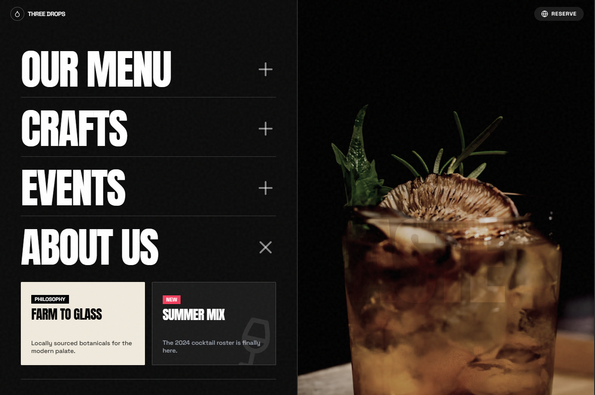

# Three-Drops-Restaurant
Three Drops is a dramatic restaurant and cocktail bar landing page template built for hospitality brands that want an elevated, nightlife-inspired online presence.

## What’s Included
- Hero with slideshow imagery (cocktails, food, ambience)
- Bold section navigation for Menu, Crafts, Events, About
- Prominent Book A Table reservation CTA
- Weekly Highlights horizontal scroll menu showcase
- Footer with FAQ, Careers, locations, and contact info

## Key Features
- Dark, cinematic aesthetic ideal for upscale bars and kitchens
- Farm-to-glass storytelling blocks to share philosophy and seasonal menus
- Reservations-first layout to drive bookings quickly
- Mobile-friendly grid using Tailwind CSS for responsive design
- Subtle animations & noise texture for a refined, modern feel

Use this template to launch or refresh a bar, bistro, or modern restaurant site that highlights signature drinks, curated dishes, and special events while converting visitors into reservations.
